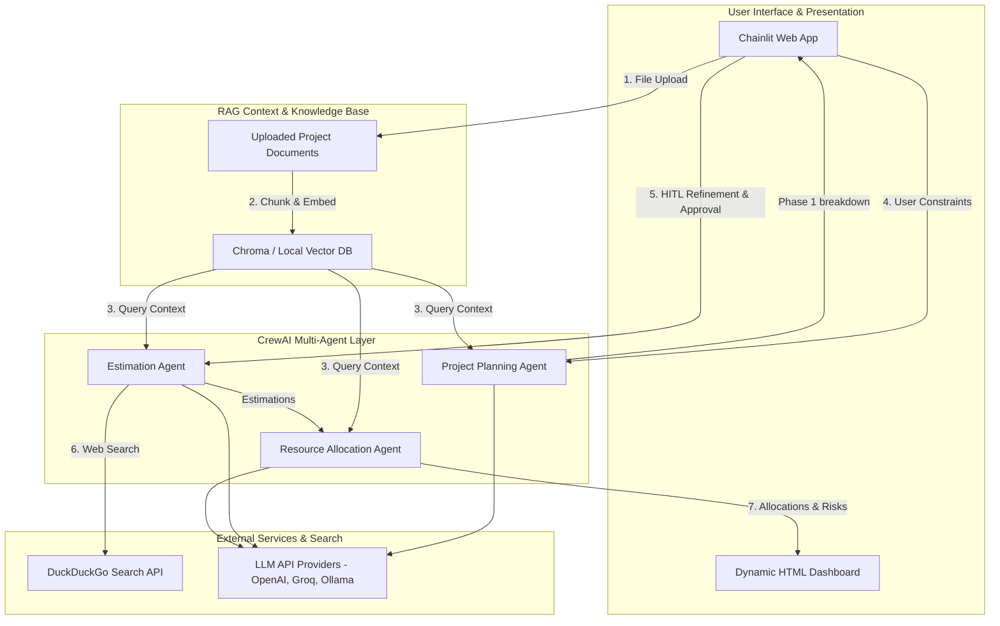
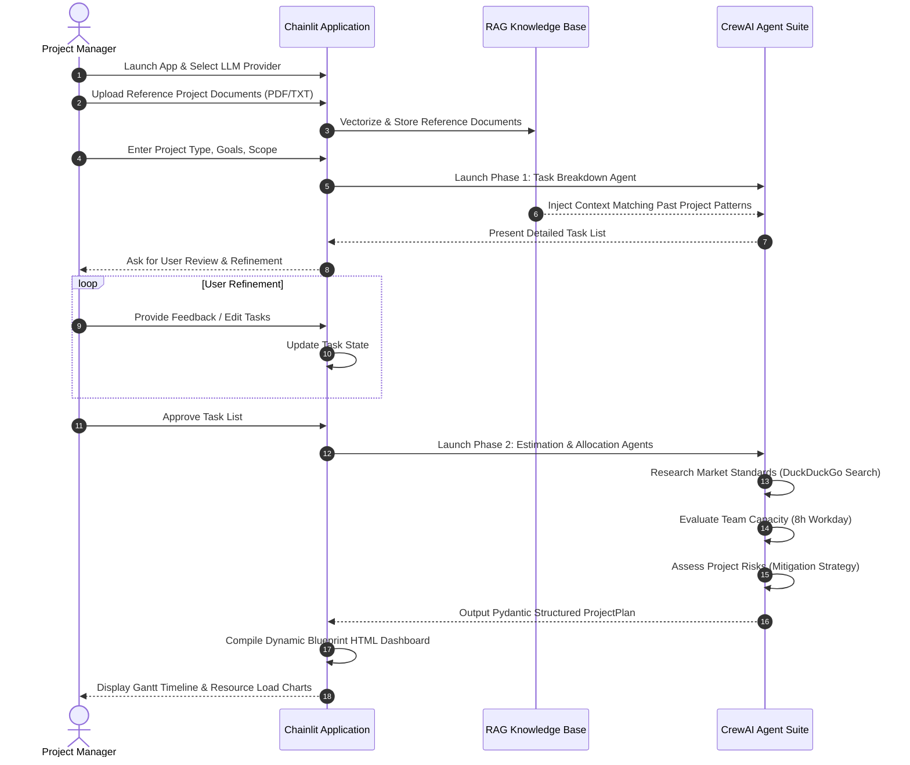

# 🚀 Multi-Agent Project Planning Suite

[](https://opensource.org/licenses/MIT)
[](https://www.python.org/)
[](https://github.com/crewAIInc/crewAI)
[](https://github.com/Chainlit/chainlit)

An intelligent, multi-agent project planning system built with **CrewAI** and **Chainlit**. This suite automates software project decomposition, resource capacity planning, and risk identification. Using a sequential **Human-in-the-Loop (HITL)** loop and **RAG (Retrieval-Augmented Generation)**, the agents generate structured timelines, Gantt charts, and resource allocation dashboards.

---

## 📋 Table of Contents

1. [System Architecture](#-system-architecture)
2. [Application Flow](#%EF%B8%8F-application-flow)
3. [Key Features](#-key-features)
4. [Technology Stack](#-technology-stack)
5. [Prerequisites](#-prerequisites)
6. [Installation & Setup](#-installation--setup)
7. [Environment Configuration](#-environment-configuration)
8. [Developer Experience & Test Guide](#-developer-experience--test-guide)
9. [Security Considerations](#-security-considerations)
10. [Performance Optimizations](#-performance-optimizations)
11. [License](#-license)

---

## 🏗️ System Architecture

The suite splits responsibilities across the frontend UI, RAG Vector Database storage, and the CrewAI agent execution layer.



---

## 🗺️ Application Flow

The system coordinates the breakdown, review, and resource calculation phases sequentially.



---

## ✨ Key Features

*   **Sequential HITL Validation Loop**: The execution halts after Phase 1 (Task Breakdown), allowing users to refine, delete, or append tasks before proceeding.
*   **Contextual RAG Knowledge Base**: Upload past project documentation or estimation spreadsheets. Agents dynamically search these records using vector embeddings to match similar tasks.
*   **Real-time Web Search Integration**: The Estimation Agent queries DuckDuckGo Search in real-time to reference current tech-stack standards and realistic delivery timelines.
*   **Visual Blueprint Dashboard**: Dynamically compiles an HTML Gantt timeline, calculates individual developer hours, warns of workload imbalances (> 40h/week), and catalogs severity-badged risks.

---

## 🛠️ Technology Stack

*   **Orchestration**: CrewAI, LangChain
*   **User Interface**: Chainlit, HTML5/CSS3 (Industrial Blueprint Theme)
*   **Retrieval System**: HuggingFace Sentence-Transformers, Chroma DB
*   **Package Manager**: UV (Astral)

---

## ⚙️ Prerequisites

*   Python 3.11 or higher
*   [UV Package Manager](https://github.com/astral-sh/uv) installed on your system.

---

## 🚀 Installation & Setup

1. **Clone the repository**:
   ```bash
   git clone https://github.com/Sh1vaay/multi-agent-planning-suite.git
   cd multi-agent-planning-suite
   ```

2. **Sync dependencies using uv**:
   ```bash
   uv sync
   ```

3. **Activate the virtual environment**:
   ```bash
   source .venv/bin/activate  # On Windows: .venv\Scripts\activate
   ```

---

## 🔑 Environment Configuration

Copy the template environment configuration file:
```bash
cp .env.example .env
```

Configure your choice of provider in `.env`:
```env
MODEL_PROVIDER=openai
OPENAI_API_KEY=your_key_here
```

---

## 💻 Developer Experience & Test Guide

### Run UI Server Locally
To start the interactive Chainlit planning portal:
```bash
uv run chainlit run src/multiagent/app.py -w
```

### Run Batch Planner Script
To run a automated planning task directly from your terminal:
```bash
uv run python src/multiagent/project_planning.py
```

---

## 🛡️ Security Considerations

*   **Credential Handling**: All secrets, including OpenAI or Groq API keys, are loaded dynamically through system environment paths. No credentials are saved in git records.
*   **File Staging Security**: User uploads are placed in localized staging subfolders (`./knowledge/` and `.files/`) before parsing to prevent traversal issues.

---

## ⚡ Performance Optimizations

*   **Token Optimization**: Embedding vector similarity search filters matching context to prevent token budget waste.
*   **Local Embedding Models**: By default, local HuggingFace embeddings (`sentence-transformers/all-MiniLM-L6-v2`) are used for non-OpenAI setups, avoiding additional API costs.

---

## 📄 License

Distributed under the MIT License. See `LICENSE` for details.
